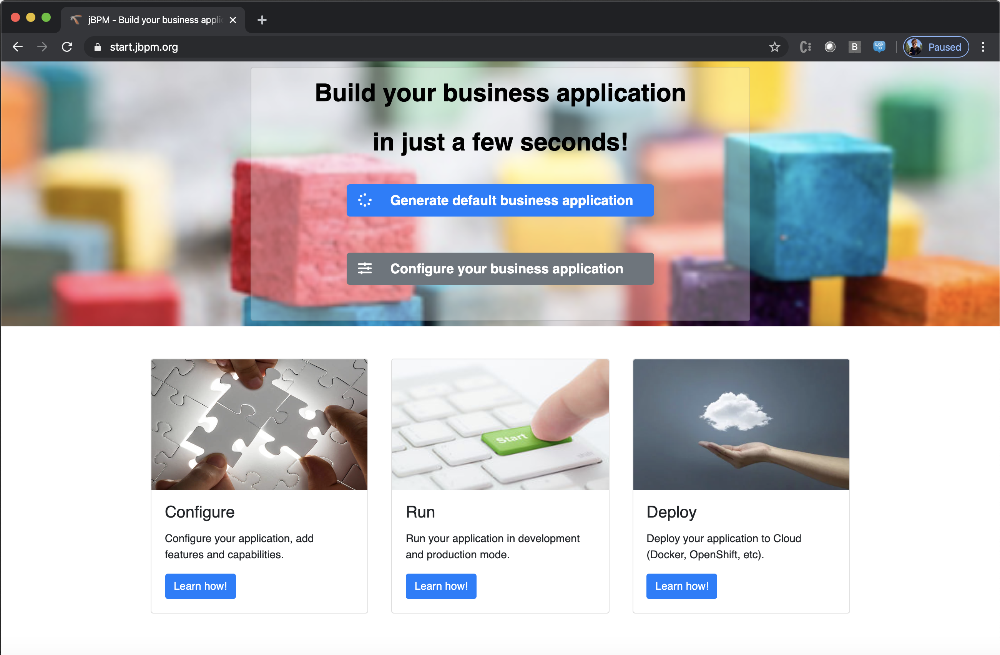
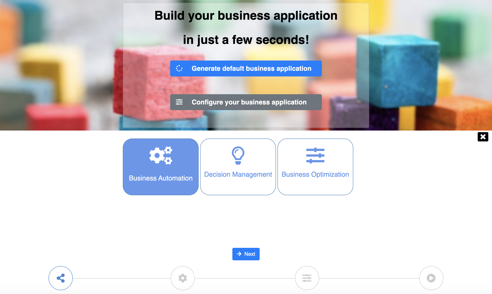
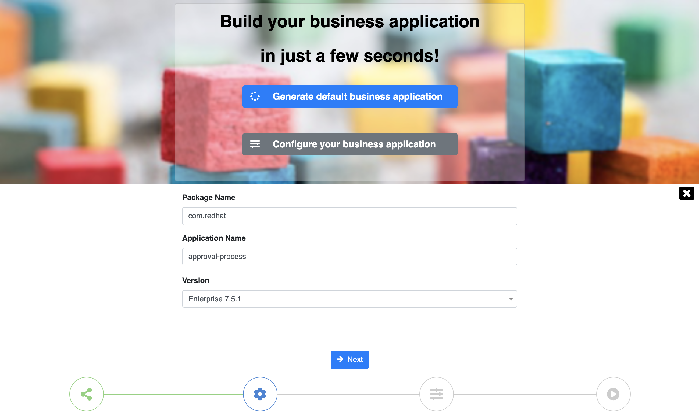
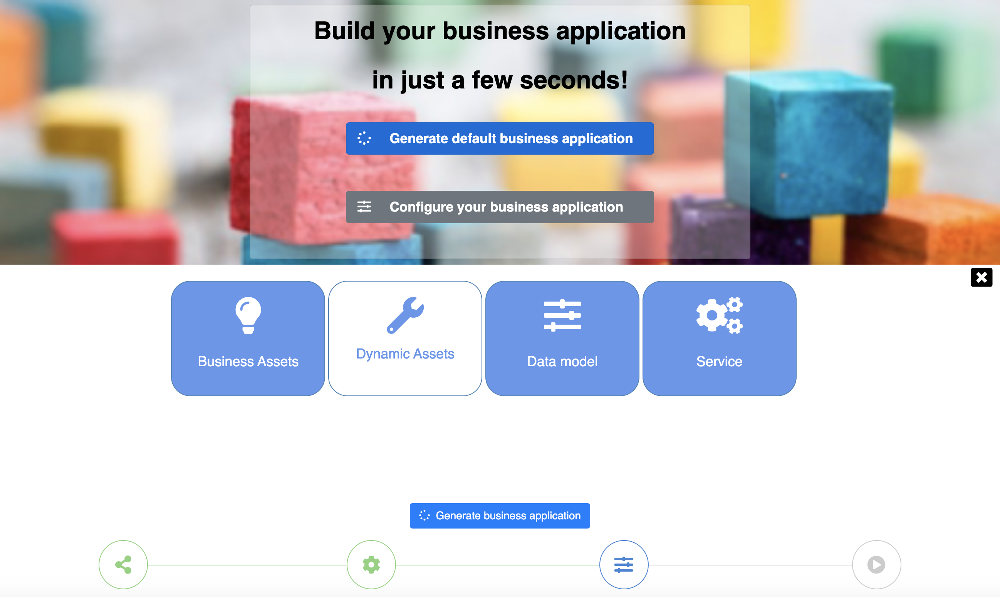
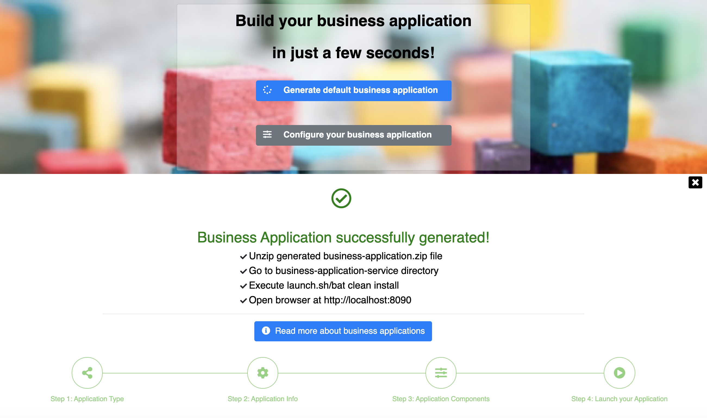

:scrollbar:
:toc2:
:dmn_github: link:https://github.com/gpe-mw-training/bxms_decision_mgmt_foundations_lab/tree/master/dmn[DMN GitHub repository]
:gitHub_repo: link:https://github.com/gpe-mw-training/bxms_decision_mgmt_foundations_lab[GitHub repository]
:business_central: link:https://localhost:8080/business-central[Business Central]
:kie_server: link:https://localhost:8080/kie-server[KIE Server]
:kie_server_swagger: link:https://localhost:8080/kie-server/docks[KIE Server Swagger Page]
:linkattrs:

== KIE & SpringBoot

This is a KIE and Spring Boot lab in which you will develop a Spring Boot based process-service.
This process-service will use persistence, transactions, custom WorkItemHandlers, etc. to demonstrate the implementation of an enterprise-class service.

.Goals
* Use https://start.jbpm.org to bootstrap a new Spring Boot-based KIE service.

* Package the Spring Boot service in an OpenShift container image
* Deploy and run the Spring Boot service on OpenShift.

.Prerequisite
* An IDE (e.g. Eclipse, IntelliJ, Visual Studio Code).
* An OpenShift environment

## Spring Boot

Spring Boot is an open-source framework targeted at building Java-based (micro) services.
Spring Boot does not need an application server to run, as it packages all required frameworks and libraries in the application JAR itself, making the application a runnable entity.
Configuration of packaged libraries and frameworks, i.e. servlet-container, JPA framework, transaction manager, is done automatically whenever possible.
The platform uses so called _Spring Boot Starters_ to simplify the build configuration. These startes automatically bring in the dependencies they require at compile and runtime.

Features:

. Create stand-alone Spring applications
. Embed Tomcat, Jetty or Undertow directly (no need to deploy WAR files)
. Provide opinionated 'starter' dependencies to simplify your build configuration
. Automatically configure Spring and 3rd party libraries whenever possible
. Provide production-ready features such as metrics, health checks and externalized configuration
. Absolutely no code generation and no requirement for XML configuration

## start.jbpm.org

At https://start.jbpm.org[start.jbpm.org], we provide an online tool to configure and bootstrap your KIE Spring Boot application.
After going through the wizard, and selecting the required options, the bootstraps a Maven project for your application and makes it available for download.

We will now use this tool to bootstrap this lab's project.

. Navigate to https://start.jbpm.org
+

+
. Click on `Configure your business application`.
. We can now select the type of _Business Application_ we want to create. Select `Business Automation` and click on `Next`.
+

+
. After selecting the type of project , we have to defined the _Package Name_, _Application Name_ and _Version_ of our application. The _Version_ field allows us to select which version of KIE we would like to use in our service.
This field allows us to not only choose upstream community versions, but also Red Hat Process Automation Manager product versions.
Use the following values and click on `Next`:
.. Package Name: `com.redhat`
.. Application Name: `approval-process`
.. Version: Enterprise `7.5.1.`
+

+
. We can now choose which assets we would like to have pre-generated, i.e. the `Business Assets` (BPMN Process Model), `Dynamic Assets` (BPMN-based Case Model), `Data Model` and `Service`.
Leave the `Business Assets`, `Data Model` and `Service` selected and click on `Generate business application`:
+

. The _Business Application_ is generated, and you will be presented with a ZIP file to download. Store this ZIP file on your machine.
+

+
. Navigate to the directory in which you've stored the `approval-process.zip` that you've just downloaded. Unzip the file: `unzip approval-process.zip`. This will create 3 Maven projects:
.. approval-process-kjar: contains the business assets like the process definition and business rules/decisions.
.. approval-process-model: contains the application's data-model.
.. approval-process-service: contains the Spring Boot infrastructure code and configuration to bootstrap and configure the service.
. Open your IDE of choice (i.e. Eclipse, IntelliJ, Visual Studio Code) and import the 3 Maven projects into your IDE. In these lab instructions we are using Visual Studio Code.
